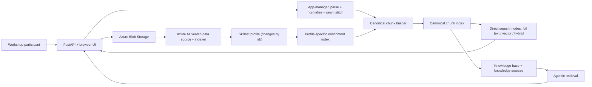
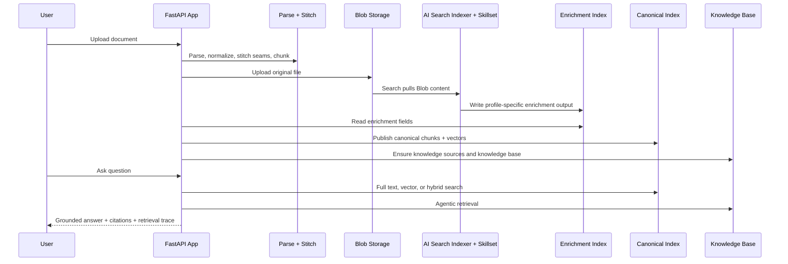

# AI Search Lab

This is the workshop-first build of the project. It is designed to teach two things with the same source document:

1. how Azure AI Search built-in skills change what gets indexed
2. how different retrieval methods change what gets found

The core workshop intentionally stays focused on four Azure AI Search retrieval modes:

- full text search
- vector search
- hybrid search
- agentic retrieval

The same document is re-ingested through progressively richer Azure AI Search skillset profiles so participants can isolate what changed in ingestion and what changed in retrieval.

## Quick Navigation

- [Why This Repo Exists](#why-this-repo-exists)
- [Start Here If You Are New To AI Search](#start-here-if-you-are-new-to-ai-search)
- [Azure AI Search And Foundry IQ](#azure-ai-search-and-foundry-iq)
- [Azure AI Search Mental Model](#azure-ai-search-mental-model)
- [Search Modes In This Workshop](#search-modes-in-this-workshop)
- [What Happens When You Upload One Document](#what-happens-when-you-upload-one-document)
- [Choosing A Search Mode](#choosing-a-search-mode)
- [Workshop Design](#workshop-design)
- [Progressive Lab Sequence](#progressive-lab-sequence)
- [Executable Lab Notebooks](#executable-lab-notebooks)
- [Architecture](#architecture)
- [Prerequisites](#prerequisites)
- [Azure Resources To Deploy](#azure-resources-to-deploy)
- [Deployment Setup](#deployment-setup)
- [Running The App](#running-the-app)
- [Execution Pattern](#execution-pattern)
- [Ingestion To Search Flow](#ingestion-to-search-flow)
- [RAG Best Practices In This Workshop](#rag-best-practices-in-this-workshop)
- [Built-In Skills Used In The Workshop](#built-in-skills-used-in-the-workshop)
- [Recommended Prompts](#recommended-prompts)
- [Optional Extensions](#optional-extensions)
- [Key Files](#key-files)

## Why This Repo Exists

This workshop is not a “PDF upload plus chat” demo.

It is designed to show that grounded answer quality depends on:

- extraction quality
- structure preservation
- seam repair across large-document extraction batches
- chunking strategy
- paragraph-aware chunk boundaries
- page-accurate chunk provenance
- enrichment quality
- metadata design
- retrieval method
- evidence presentation

The application keeps deterministic control over parsing, seam stitching, canonical chunk IDs, and chunk publishing. Azure AI Search then adds a Search-managed Blob enrichment lane and multiple retrieval options over the resulting corpus.

## Start Here If You Are New To AI Search

If you are new to RAG, this workshop is easiest to follow with one simple mental model:

- your files are not searched directly
- your files are first extracted, cleaned, chunked, and indexed
- retrieval quality depends on how that preparation was done
- Azure AI Search is the retrieval and enrichment platform used to index and search that prepared content

This repo teaches RAG in two layers:

1. **Ingestion quality**
   - how extraction, chunking, enrichment, and metadata change what becomes searchable
2. **Retrieval quality**
   - how `full_text`, `vector`, `hybrid`, and `agentic` retrieval change what is actually found

If you only remember one thing, remember this:

> RAG quality is usually decided before the LLM answers anything.

## Azure AI Search And Foundry IQ

### Azure AI Search

Azure AI Search is the programmable indexing and retrieval layer used directly in this workshop. It provides:

- Blob data sources and indexers
- skillsets and enrichment pipelines
- full text, vector, and hybrid search
- knowledge sources and knowledge bases
- agentic retrieval

### Foundry IQ

Foundry IQ is the managed knowledge experience built on the same retrieval model. This repo uses Azure AI Search APIs directly so the audience can see the retrieval objects and compare ingestion and retrieval behavior in detail, while still using Foundry-hosted model deployments for answer synthesis and embeddings.

## Azure AI Search Mental Model

These are the core Azure AI Search objects you need to understand for the workshop:

| Object | Plain-language meaning | How this repo uses it |
| --- | --- | --- |
| Blob container | Where the original source documents live | The Search indexer reads uploaded documents from `documents` |
| Data source | The Search connection to Blob | Points the indexer at the workshop Blob container |
| Skillset | The enrichment pipeline Azure AI Search runs during indexing | Chosen per upload with the **Skill Profile** picker (defaults to `WORKSHOP_SKILL_PROFILE`) |
| Indexer | The job that reads from the data source, runs the skillset, and writes to an index | Runs the Blob + skillset lane |
| Index | The searchable store | The workshop uses a canonical chunk index and a profile-specific enrichment index |
| Semantic configuration | Per-index settings that tell the semantic ranker which title, content, and keyword fields to rerank on | `default-semantic-config` powers `hybrid` reranking, captions, and agentic reranking |
| Knowledge source | A retrieval source used by agentic retrieval (preview) | Usually points at a Search index |
| Knowledge base | The object queried by agentic retrieval (preview) | Used in Lab 07 and later |

The workshop is easier to follow if you keep this separation in mind:

- **Indexer side**: data source, skillset, indexer, enrichment index
- **Query side**: direct search or knowledge-base retrieval

## Search Modes In This Workshop

The chat UI exposes four retrieval modes.

| Mode | Azure AI Search surface | Ranking | What it demonstrates | How this repo uses it |
| --- | --- | --- | --- | --- |
| `full_text` | Direct `docs/search` query over the canonical index | BM25 only | lexical relevance, exact terms, BM25-style matching | Pure lexical baseline after `DocumentExtractionSkill` |
| `vector` | Direct `docs/search` with `vectorQueries` | HNSW vector similarity | semantic similarity and paraphrase handling | Enabled once chunk embeddings exist |
| `hybrid` | Direct `docs/search` with both `search` and `vectorQueries` | RRF fusion + semantic ranker (L2) | combined lexical + semantic recall, then reranked | Best direct-search comparison track |
| `agentic` | Knowledge base `retrieve` action | per-subquery hybrid + semantic ranker | query planning, subqueries, source selection, grounded synthesis | Final official retrieval feature in the workshop |

> Ranking note: `full_text` in this workshop is deliberately kept to pure BM25 so it is an honest lexical control. `hybrid` fuses the BM25 and vector result sets with [Reciprocal Rank Fusion (RRF)](https://learn.microsoft.com/en-us/azure/search/hybrid-search-ranking) and then applies the [semantic ranker](https://learn.microsoft.com/en-us/azure/search/semantic-search-overview) (L2 reranking) plus extractive captions. Agentic retrieval reranks every subquery the same way. The semantic ranker is a separately billed premium feature with [regional availability limits](https://learn.microsoft.com/en-us/azure/search/search-region-support), so confirm it is enabled on your search service before running Labs 04 through 08.

The workshop keeps these modes intentionally separate:

- Labs 03 through 06 compare ingestion improvements and direct retrieval behavior.
- Lab 07 switches to agentic retrieval over the same corpus.
- Knowledge sources, knowledge bases, and agentic retrieval are still preview features in Azure AI Search, so treat Lab 07 as a forward-looking capability rather than a production-locked contract.

## What Happens When You Upload One Document

One upload creates more than one useful artifact:

1. the app parses and chunks the document into a canonical chunk set
2. the original file is uploaded to Blob so Azure AI Search can enrich it
3. the Search indexer runs the skillset profile chosen for that upload
4. the app merges useful Search-generated fields back into the canonical chunk set
5. the canonical chunk set is published to the retrieval index
6. the knowledge base is updated so agentic retrieval can query that corpus

In practice, one uploaded document can create these searchable surfaces:

| Surface | Purpose |
| --- | --- |
| Canonical chunk index | The main retrieval surface for full-text, vector, and hybrid search |
| Enrichment index | The Search-managed view of summaries, OCR outputs, descriptions, and other enrichment outputs |
| Knowledge base | The agentic retrieval surface that plans and grounds answers over one or more knowledge sources |

## Choosing A Search Mode

Use these rules of thumb during the workshop and in real projects:

| If your question is mostly about... | Start with | Why |
| --- | --- | --- |
| exact terms, product names, quoted phrases | `full_text` | pure BM25 lexical matching is the clearest baseline |
| paraphrases, concept similarity, related wording | `vector` | semantic similarity can recover near-matches |
| a mix of exact terms and paraphrases | `hybrid` | fuses lexical and vector evidence with RRF, then reranks with the semantic ranker |
| multi-part questions, decomposition, cross-source reasoning | `agentic` | knowledge-base retrieval can plan and ground across sources |

The workshop intentionally teaches `agentic` after the other three modes so participants can see what it adds instead of treating it as magic.

## Workshop Design

The design pattern is fixed throughout the workshop:

1. Pick one representative PDF.
2. Keep the source file constant.
3. Choose the lab's profile in the **Skill Profile** picker on the upload screen.
4. Upload the same document again.
5. Compare retrieval modes against the new index state.

This keeps the document variable fixed so the audience can attribute changes to the skillset profile or search mode instead of to a different source file. The `WORKSHOP_SKILL_PROFILE` environment value only sets the picker's default, so no app restart is needed to switch profiles between labs.

## Progressive Lab Sequence

Run the labs in order.

1. [Lab 00 - Prerequisites And Workshop Framing](./docs/labs/lab-00-prerequisites-and-framing.md)
2. [Lab 01 - Provision Azure Resources](./docs/labs/lab-01-provision-azure-resources.md)
3. [Lab 02 - Configure Models, Identities, And Environment](./docs/labs/lab-02-configure-models-identities-and-env.md)
4. [Lab 03 - Baseline Extraction And Full Text Search](./docs/labs/lab-03-baseline-extraction.md)
5. [Lab 04 - Chunking, Embeddings, And Vector Search](./docs/labs/lab-04-chunking-and-vectorization.md)
6. [Lab 05 - Hybrid Search With Generative Enrichment](./docs/labs/lab-05-generative-enrichment.md)
7. [Lab 06 - Visual And NLP Enrichment](./docs/labs/lab-06-image-and-nlp-enrichment.md)
8. [Lab 07 - Agentic Retrieval](./docs/labs/lab-07-agentic-retrieval.md)
9. [Lab 08 - Optional Content Understanding Upgrade](./docs/labs/lab-08-optional-content-understanding-skill-upgrade.md)
10. [Lab 09 - Multi-Source Knowledge Routing](./docs/labs/lab-09-multi-source-knowledge-routing.md)
11. [Lab 10 - Troubleshooting And Verification](./docs/labs/lab-10-troubleshooting-and-verification.md)

### Lab matrix

| Lab | Skill Profile | Retrieval mode focus | What changes | What to observe |
| --- | --- | --- | --- | --- |
| 03 | `baseline_extract` | `full_text` | `DocumentExtractionSkill` only | lexical baseline and whole-document noise |
| 04 | `chunk_vector` | `full_text`, `vector`, `hybrid` | `SplitSkill` and `AzureOpenAIEmbeddingSkill` | chunk precision, semantic recall, hybrid lift |
| 05 | `genai_enrichment` | `hybrid` | `ChatCompletionSkill` summaries and keyword hints | better retrieval cues and ranking |
| 06 | `visual_nlp` | `hybrid` | OCR, image analysis, language detection | diagram text, image descriptions, richer evidence |
| 07 | keep the best prior profile | `agentic` | switch from direct search to knowledge-base retrieval | subqueries, decomposition, grounded synthesis |
| 08 | `content_understanding` | `hybrid`, `agentic` | Search-managed semantic extraction alternative | chunk boundary quality and structure handling |
| 09 | `genai_enrichment` (+ extra source) | `hybrid`, `agentic` | a second knowledge source on a new topic | per-question routing across multiple indexes |

## Executable Lab Notebooks

The [`notebooks/`](./notebooks/) folder contains executed Jupyter notebooks — one
per lab plus a final comparison notebook — that drive the **same backend pipeline
the UI runs**, in-process, against live Azure AI Search. They are committed with
real outputs so you can read the ingestion stats, retrieval hits, and grounded
answers without running anything. See the [notebooks README](./notebooks/README.md)
for details. The final [comparison notebook](./notebooks/lab-10-comparison-summary.ipynb)
puts full-text, vector, hybrid, and agentic retrieval side-by-side on the same two
questions to make the trade-offs concrete.

## Architecture



### Design rules

- The file is never the indexed unit.
- Large-document segmentation is an extraction concern, not a retrieval boundary.
- The app owns deterministic chunk IDs, seam repair, paragraph-aware chunking, and page-accurate citation spans.
- Azure AI Search owns the Blob skillset lane and the retrieval methods shown in the chat lab.
- `WORKSHOP_STRICT_MODE=true` keeps required Azure paths honest.

## Prerequisites

### Local

- Windows with PowerShell
- Python 3.11+
- Azure CLI authenticated to the target subscription
- Node.js if you want to run frontend checks locally

### Azure

- Azure AI Search
- Azure Blob Storage
- Azure AI Document Intelligence
- Azure AI Foundry resource with deployed models
- Azure Content Understanding only for Lab 08

### Required model deployments

- `AZURE_FOUNDRY_CHAT_DEPLOYMENT`
  Used by the app-owned grounded synthesis path.
- `AZURE_SEARCH_LLM_DEPLOYMENT`
  Used by Azure AI Search knowledge-base planning and answer synthesis.
- `AZURE_SEARCH_NATIVE_CHAT_COMPLETION_DEPLOYMENT`
  Used only in the native multimodal retrieval lab. Keep it separate from `AZURE_SEARCH_LLM_DEPLOYMENT` for workshop reliability.
- `AZURE_OPENAI_EMBEDDING_DEPLOYMENT`
  Used for canonical chunk vectors and Search-managed integrated vectorization.
- `AZURE_OPENAI_EMBEDDING_MODEL_NAME`
  The Azure AI Search vectorizer uses the model family name such as `text-embedding-3-large`, not the deployment alias.
- `AZURE_STORAGE_ACCOUNT_KEY`
  Leave this blank for the core workshop run. The repo is designed to use the signed-in Azure identity and RBAC for Blob access.

## Azure Resources To Deploy

The core workshop needs:

- one Azure AI Search service
- one Azure Storage account with these containers:
  - `documents`
  - `document-figure-artifacts`
  - `search-enrichment-cache`
- one Azure AI Document Intelligence resource
- one Azure AI Foundry resource with deployed models

Provision the core stack with the included script:

```powershell
pwsh -ExecutionPolicy Bypass -File .\scripts\provision-azure.ps1 `
  -SubscriptionId "<subscription-id>" `
  -Location "eastus" `
  -ResourceGroupName "rg-ai-search-lab" `
  -ExistingFoundryResourceGroup "<foundry-resource-group>" `
  -ExistingFoundryResourceName "<foundry-resource-name>"
```

If you want the script to create model deployments too, the workshop defaults are already pinned to the tested versions and 100-capacity starting point. This workshop now defaults to the same supported LLM family for each generative role, but keeps separate deployment names so Search planning, native multimodal synthesis, and app-side synthesis do not compete for the same TPM budget.

```powershell
pwsh -ExecutionPolicy Bypass -File .\scripts\provision-azure.ps1 `
  -SubscriptionId "<subscription-id>" `
  -Location "eastus" `
  -ResourceGroupName "rg-ai-search-lab" `
  -ExistingFoundryResourceGroup "<foundry-resource-group>" `
  -ExistingFoundryResourceName "<foundry-resource-name>" `
  -CreateOptionalModelDeployments `
  -ChatDeploymentCapacity 100 `
  -PlanningDeploymentCapacity 100 `
  -NativeChatDeploymentCapacity 100 `
  -EmbeddingDeploymentCapacity 100
```

### Required role assignments

- The Azure AI Search service managed identity needs `Cognitive Services User` on the Foundry resource.
- The app process or signed-in user needs Blob upload permission on the source container used for workshop documents.

## Deployment Setup

1. Copy [`.env.example`](./.env.example) to `.env`.
2. Fill in Search, Blob, Document Intelligence, and Foundry values.
3. Start with these core workshop defaults:

```dotenv
WORKSHOP_STRICT_MODE=true
WORKSHOP_SKILL_PROFILE=baseline_extract
DEFAULT_INGESTION_MODE=hybrid_blob_skillset
SEARCH_PIPELINE_MODE=hybrid_blob_skillset
AZURE_SEARCH_REQUIRE_BLOB_SKILLSET_SUCCESS=true
AZURE_SEARCH_ENABLE_ANSWER_SYNTHESIS=true
AZURE_SEARCH_ENABLE_NATIVE_MULTIMODAL_RETRIEVAL=false
AZURE_SEARCH_REQUIRE_NATIVE_MULTIMODAL_SUCCESS=false
AZURE_SEARCH_SKILLSET_PREFERRED_EXTRACTOR=document_extraction
```

> `WORKSHOP_SKILL_PROFILE` now only sets the default selection of the in-app **Skill Profile** picker. You change profiles per upload from the UI, so you no longer edit this value or restart the app between labs.

4. Configure Blob settings:

```dotenv
AZURE_SEARCH_BLOB_CONNECTION_STRING=...
AZURE_SEARCH_BLOB_SOURCE_CONTAINER=documents
AZURE_SEARCH_BLOB_SOURCE_PREFIX=workshop
AZURE_SEARCH_ENRICHMENT_CACHE_CONNECTION_STRING=...
AZURE_SEARCH_ENRICHMENT_CACHE_CONTAINER=search-enrichment-cache
```

5. Configure model settings:

```dotenv
AZURE_FOUNDRY_RESOURCE_ENDPOINT=...
AZURE_FOUNDRY_CHAT_DEPLOYMENT=gpt-5-4-mini-chat
AZURE_SEARCH_LLM_DEPLOYMENT=gpt-5-4-mini-search
AZURE_SEARCH_LLM_MODEL_NAME=gpt-5.4-mini
AZURE_SEARCH_NATIVE_CHAT_COMPLETION_DEPLOYMENT=gpt-5-4-mini-native
AZURE_OPENAI_EMBEDDING_DEPLOYMENT=text-embedding-3-large-vector
```

For a workshop, keep these as separate deployment names even if they all use `gpt-5.4-mini` underneath:

- `AZURE_FOUNDRY_CHAT_DEPLOYMENT=gpt-5-4-mini-chat`
- `AZURE_SEARCH_LLM_DEPLOYMENT=gpt-5-4-mini-search`
- `AZURE_SEARCH_NATIVE_CHAT_COMPLETION_DEPLOYMENT=gpt-5-4-mini-native`

That makes the model roles easier to teach and reduces cross-feature throttling during the live session.

6. Use [Environment Reference](./docs/environment-reference.md) for the full setting list.

## Running The App

From the repository root, install dependencies once:

```powershell
python -m venv .venv
.venv\Scripts\Activate.ps1
pip install -r requirements.txt
```

Then launch with the helper script, which loads `.env` before starting uvicorn:

```powershell
pwsh -ExecutionPolicy Bypass -File .\scripts\run-local-app.ps1 -Port 8016
```

> Launching `uvicorn` directly does not read `.env`, so the Azure feature flags stay unset and the app runs in offline/disabled mode. Use the script (or export the variables yourself) for any Azure-backed run.

Open:

- [App UI](http://127.0.0.1:8016/)
- [Health Check](http://127.0.0.1:8016/api/health)
- [Config Summary](http://127.0.0.1:8016/api/config)
- [Workshop Profiles](http://127.0.0.1:8016/api/workshop/profiles)

`8016` is just an example. Use any free local port for a fresh workshop run.

## Execution Pattern

Use this pattern for every lab after the environment is ready:

1. Open the upload screen and choose the lab's profile in the **Skill Profile** picker.
2. Upload the same document again.
3. Wait until the corpus reaches `ready`.
4. Use the retrieval mode required by the lab.
5. Ask the same comparison prompts.
6. Record what improved and what did not.

## Ingestion To Search Flow



### Processing contract

1. Upload or generate a document.
2. Detect document type and parser path.
3. Segment oversized PDFs for extraction only.
4. Parse and preserve structure.
5. Stitch cross-segment seams.
6. Build canonical chunks.
7. Upload the original file to Blob Storage.
8. Run the active Azure AI Search skillset profile over the Blob source.
9. Merge Search-managed enrichment fields back into the canonical chunk set.
10. Publish canonical chunks to the retrieval index.
11. Use the chat retrieval selector to compare full text, vector, hybrid, and agentic retrieval over that corpus.

## RAG Best Practices In This Workshop

These are the main best practices the labs are trying to teach:

- do not treat a whole PDF as one retrieval unit
- preserve structure and page provenance during extraction
- split large documents for extraction only, then stitch them back into coherent retrieval units
- keep chunk boundaries semantically coherent instead of arbitrary
- add enrichment fields as supplements, not replacements, for source text
- compare lexical, vector, and hybrid retrieval before jumping to agentic retrieval
- understand how results are ranked: BM25 for lexical, HNSW similarity for vector, [RRF](https://learn.microsoft.com/en-us/azure/search/hybrid-search-ranking) to fuse them, and the [semantic ranker](https://learn.microsoft.com/en-us/azure/search/semantic-search-overview) (L2) to rerank and produce captions
- use agentic retrieval when the question benefits from planning, subqueries, or multi-source reasoning
- keep workshop and production systems honest by failing fast when required Azure steps do not complete

## Built-In Skills Used In The Workshop

| Profile | Skills used directly in the workshop | Primary retrieval comparison |
| --- | --- | --- |
| `baseline_extract` | `DocumentExtractionSkill` | full text baseline |
| `chunk_vector` | `DocumentExtractionSkill`, `SplitSkill`, `AzureOpenAIEmbeddingSkill` | vector and hybrid |
| `genai_enrichment` | prior profile plus `ChatCompletionSkill` | hybrid and agentic |
| `visual_nlp` | prior profile plus `OcrSkill`, `ImageAnalysisSkill`, `LanguageDetectionSkill` | hybrid and agentic |
| `content_understanding` | `ContentUnderstandingSkill` plus embedding and generative enrichment support | hybrid and agentic |

Discussed as follow-on extensions after the core workshop:

- `GenAI Prompt skill`
- `EntityRecognitionSkillV3`
- `MergeSkill`
- `ShaperSkill`

## Recommended Prompts

### Lab 03

- `What major sections and themes are present in this document?`
- `Which exact phrases from the document best describe the main architecture or workflow?`

### Lab 04

- `Which chunk best explains the architecture workflow in this document?`
- `Find the part that discusses the process for indexing and retrieval even if those exact words are not used together.`

### Lab 05

- `What summary or retrieval cues make this document easier to search accurately?`
- `Which tags or summaries changed the answer quality compared with the previous lab?`

### Lab 06

- `What does the diagram say, and what extra evidence became searchable after OCR and image analysis were added?`
- `Which visual signals help the answer now that the visual profile is active?`

### Lab 07

- `Explain how the document describes ingestion, indexing, and answer generation. Separate the answer into extraction, indexing, and retrieval stages.`
- `Compare the document's view of retrieval quality, chunking, and evidence grounding. What should a team implement first and why?`

## Optional Extensions

### Content Understanding

Lab 08 shows a Search-managed alternative extraction path using Azure Content Understanding. Use it only after the core Labs 03 through 07 are working.

### Native multimodal retrieval

The codebase still contains an optional native multimodal service path for Blob knowledge sources, answer synthesis, and image serving. It is intentionally not part of the core workshop sequence so the audience can first learn the four main search modes without another retrieval branch in the UI.

## Key Files

- [FastAPI entrypoint](./backend/app.py)
- [Ingestion pipeline](./backend/services/pipeline.py)
- [Search-managed Blob enrichment](./backend/services/search_skillset_enrichment.py)
- [Azure AI Search adapter](./backend/services/indexing.py)
- [Grounded chat and synthesis](./backend/services/chat.py)
- [Workshop profile catalog](./backend/services/workshop_profiles.py)
- [Environment reference](./docs/environment-reference.md)
- [Workshop labs](./docs/labs/)
