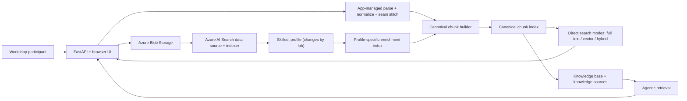
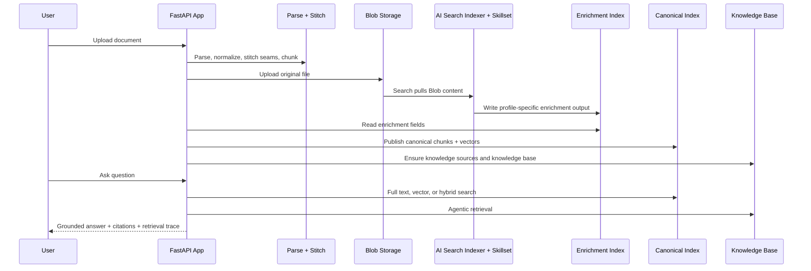

# AI Search Lab

This is the workshop-first build of the project. It is designed to teach two things with the same source document:

1. how Azure AI Search built-in skills change what gets indexed
2. how different retrieval methods change what gets found

The core workshop intentionally stays focused on four Azure AI Search retrieval modes:

- full text search
- vector search
- hybrid search
- agentic retrieval

The same document is re-ingested through progressively richer Azure AI Search skillset profiles so participants can isolate what changed in ingestion and what changed in retrieval.

## Quick Navigation

- [Why This Repo Exists](#why-this-repo-exists)
- [Azure AI Search And Foundry IQ](#azure-ai-search-and-foundry-iq)
- [Search Modes In This Workshop](#search-modes-in-this-workshop)
- [Workshop Design](#workshop-design)
- [Progressive Lab Sequence](#progressive-lab-sequence)
- [Architecture](#architecture)
- [Prerequisites](#prerequisites)
- [Azure Resources To Deploy](#azure-resources-to-deploy)
- [Deployment Setup](#deployment-setup)
- [Running The App](#running-the-app)
- [Execution Pattern](#execution-pattern)
- [Ingestion To Search Flow](#ingestion-to-search-flow)
- [Built-In Skills Used In The Workshop](#built-in-skills-used-in-the-workshop)
- [Recommended Prompts](#recommended-prompts)
- [Optional Extensions](#optional-extensions)
- [Key Files](#key-files)

## Why This Repo Exists

This workshop is not a “PDF upload plus chat” demo.

It is designed to show that grounded answer quality depends on:

- extraction quality
- structure preservation
- seam repair across large-document extraction batches
- chunking strategy
- paragraph-aware chunk boundaries
- page-accurate chunk provenance
- enrichment quality
- metadata design
- retrieval method
- evidence presentation

The application keeps deterministic control over parsing, seam stitching, canonical chunk IDs, and chunk publishing. Azure AI Search then adds a Search-managed Blob enrichment lane and multiple retrieval options over the resulting corpus.

## Azure AI Search And Foundry IQ

### Azure AI Search

Azure AI Search is the programmable indexing and retrieval layer used directly in this workshop. It provides:

- Blob data sources and indexers
- skillsets and enrichment pipelines
- full text, vector, and hybrid search
- knowledge sources and knowledge bases
- agentic retrieval

### Foundry IQ

Foundry IQ is the managed knowledge experience built on the same retrieval model. This repo uses Azure AI Search APIs directly so the audience can see the retrieval objects and compare ingestion and retrieval behavior in detail, while still using Foundry-hosted model deployments for answer synthesis and embeddings.

## Search Modes In This Workshop

The chat UI exposes four retrieval modes.

| Mode | Azure AI Search surface | What it demonstrates | How this repo uses it |
| --- | --- | --- | --- |
| `full_text` | Direct `docs/search` query over the canonical index | lexical relevance, exact terms, BM25-style matching | Best baseline after `DocumentExtractionSkill` |
| `vector` | Direct `docs/search` with `vectorQueries` | semantic similarity and paraphrase handling | Enabled once chunk embeddings exist |
| `hybrid` | Direct `docs/search` with both `search` and `vectorQueries` | combined lexical + semantic recall | Best direct-search comparison track |
| `agentic` | Knowledge base `retrieve` action | query planning, subqueries, source selection, grounded synthesis | Final official retrieval feature in the workshop |

The workshop keeps these modes intentionally separate:

- Labs 03 through 06 compare ingestion improvements and direct retrieval behavior.
- Lab 07 switches to agentic retrieval over the same corpus.

## Workshop Design

The design pattern is fixed throughout the workshop:

1. Pick one representative PDF.
2. Keep the source file constant.
3. Change `WORKSHOP_SKILL_PROFILE`.
4. Re-upload the same document.
5. Compare retrieval modes against the new index state.

This keeps the document variable fixed so the audience can attribute changes to the skillset profile or search mode instead of to a different source file.

## Progressive Lab Sequence

Run the labs in order.

1. [Lab 00 - Prerequisites And Workshop Framing](./docs/labs/lab-00-prerequisites-and-framing.md)
2. [Lab 01 - Provision Azure Resources](./docs/labs/lab-01-provision-azure-resources.md)
3. [Lab 02 - Configure Models, Identities, And Environment](./docs/labs/lab-02-configure-models-identities-and-env.md)
4. [Lab 03 - Baseline Extraction And Full Text Search](./docs/labs/lab-03-baseline-extraction.md)
5. [Lab 04 - Chunking, Embeddings, And Vector Search](./docs/labs/lab-04-chunking-and-vectorization.md)
6. [Lab 05 - Hybrid Search With Generative Enrichment](./docs/labs/lab-05-generative-enrichment.md)
7. [Lab 06 - Visual And NLP Enrichment](./docs/labs/lab-06-image-and-nlp-enrichment.md)
8. [Lab 07 - Agentic Retrieval](./docs/labs/lab-07-agentic-retrieval.md)
9. [Lab 08 - Optional Content Understanding Upgrade](./docs/labs/lab-08-optional-content-understanding-skill-upgrade.md)
10. [Lab 09 - Troubleshooting And Verification](./docs/labs/lab-09-troubleshooting-and-verification.md)

### Lab matrix

| Lab | `WORKSHOP_SKILL_PROFILE` | Retrieval mode focus | What changes | What to observe |
| --- | --- | --- | --- | --- |
| 03 | `baseline_extract` | `full_text` | `DocumentExtractionSkill` only | lexical baseline and whole-document noise |
| 04 | `chunk_vector` | `full_text`, `vector`, `hybrid` | `SplitSkill` and `AzureOpenAIEmbeddingSkill` | chunk precision, semantic recall, hybrid lift |
| 05 | `genai_enrichment` | `hybrid` | `ChatCompletionSkill` summaries and keyword hints | better retrieval cues and ranking |
| 06 | `visual_nlp` | `hybrid` | OCR, image analysis, language detection | diagram text, image descriptions, richer evidence |
| 07 | keep the best prior profile | `agentic` | switch from direct search to knowledge-base retrieval | subqueries, decomposition, grounded synthesis |
| 08 | `content_understanding` | `hybrid`, `agentic` | Search-managed semantic extraction alternative | chunk boundary quality and structure handling |

## Architecture



### Design rules

- The file is never the indexed unit.
- Large-document segmentation is an extraction concern, not a retrieval boundary.
- The app owns deterministic chunk IDs, seam repair, paragraph-aware chunking, and page-accurate citation spans.
- Azure AI Search owns the Blob skillset lane and the retrieval methods shown in the chat lab.
- `WORKSHOP_STRICT_MODE=true` keeps required Azure paths honest.

## Prerequisites

### Local

- Windows with PowerShell
- Python 3.11+
- Azure CLI authenticated to the target subscription
- Node.js if you want to run frontend checks locally

### Azure

- Azure AI Search
- Azure Blob Storage
- Azure AI Document Intelligence
- Azure AI Foundry resource with deployed models
- Azure Content Understanding only for Lab 08

### Required model deployments

- `AZURE_FOUNDRY_CHAT_DEPLOYMENT`
  Used by the app-owned grounded synthesis path.
- `AZURE_SEARCH_LLM_DEPLOYMENT`
  Used by Azure AI Search knowledge-base planning and answer synthesis.
- `AZURE_OPENAI_EMBEDDING_DEPLOYMENT`
  Used for canonical chunk vectors and Search-managed integrated vectorization.

## Azure Resources To Deploy

The core workshop needs:

- one Azure AI Search service
- one Azure Storage account with these containers:
  - `documents`
  - `document-figure-artifacts`
  - `search-enrichment-cache-v2`
- one Azure AI Document Intelligence resource
- one Azure AI Foundry resource with deployed models

Provision the core stack with the included script:

```powershell
pwsh -ExecutionPolicy Bypass -File .\scripts\provision-azure.ps1 `
  -SubscriptionId "<subscription-id>" `
  -Location "eastus" `
  -ResourceGroupName "rg-ai-search-lab" `
  -ExistingFoundryResourceGroup "<foundry-resource-group>" `
  -ExistingFoundryResourceName "<foundry-resource-name>"
```

### Required role assignments

- The Azure AI Search service managed identity needs `Cognitive Services User` on the Foundry resource.
- The app process or signed-in user needs Blob upload permission on the source container used for workshop documents.

## Deployment Setup

1. Copy [`.env.example`](./.env.example) to `.env`.
2. Fill in Search, Blob, Document Intelligence, and Foundry values.
3. Start with these core workshop defaults:

```dotenv
WORKSHOP_STRICT_MODE=true
WORKSHOP_SKILL_PROFILE=baseline_extract
DEFAULT_INGESTION_MODE=hybrid_blob_skillset
SEARCH_PIPELINE_MODE=hybrid_blob_skillset
AZURE_SEARCH_REQUIRE_BLOB_SKILLSET_SUCCESS=true
AZURE_SEARCH_ENABLE_ANSWER_SYNTHESIS=true
AZURE_SEARCH_ENABLE_NATIVE_MULTIMODAL_RETRIEVAL=false
AZURE_SEARCH_REQUIRE_NATIVE_MULTIMODAL_SUCCESS=false
AZURE_SEARCH_SKILLSET_PREFERRED_EXTRACTOR=document_extraction
```

4. Configure Blob settings:

```dotenv
AZURE_SEARCH_BLOB_CONNECTION_STRING=...
AZURE_SEARCH_BLOB_SOURCE_CONTAINER=documents
AZURE_SEARCH_BLOB_SOURCE_PREFIX=v2
AZURE_SEARCH_ENRICHMENT_CACHE_CONNECTION_STRING=...
AZURE_SEARCH_ENRICHMENT_CACHE_CONTAINER=search-enrichment-cache-v2
```

5. Configure model settings:

```dotenv
AZURE_FOUNDRY_RESOURCE_ENDPOINT=...
AZURE_FOUNDRY_CHAT_DEPLOYMENT=gpt-5-4
AZURE_SEARCH_LLM_DEPLOYMENT=gpt-5-mini
AZURE_SEARCH_LLM_MODEL_NAME=gpt-5-mini
AZURE_OPENAI_EMBEDDING_DEPLOYMENT=text-embedding-3-large
```

6. Use [Environment Reference](./docs/environment-reference.md) for the full setting list.

## Running The App

From the `v2` folder:

```powershell
cd .\v2
python -m venv .venv
.venv\Scripts\Activate.ps1
pip install -r requirements.txt
python -m uvicorn backend.app:app --host 127.0.0.1 --port 8016
```

Or use the launcher:

```powershell
pwsh -ExecutionPolicy Bypass -File .\scripts\run-local-app.ps1 -Port 8016
```

Open:

- [App UI](http://127.0.0.1:8016/)
- [Health Check](http://127.0.0.1:8016/api/health)
- [Config Summary](http://127.0.0.1:8016/api/config)
- [Workshop Profiles](http://127.0.0.1:8016/api/workshop/profiles)

## Execution Pattern

Use this pattern for every lab after the environment is ready:

1. Set the lab’s `WORKSHOP_SKILL_PROFILE`.
2. Restart the app.
3. Upload the same document again.
4. Wait until the corpus reaches `ready`.
5. Use the retrieval mode required by the lab.
6. Ask the same comparison prompts.
7. Record what improved and what did not.

## Ingestion To Search Flow



### Processing contract

1. Upload or generate a document.
2. Detect document type and parser path.
3. Segment oversized PDFs for extraction only.
4. Parse and preserve structure.
5. Stitch cross-segment seams.
6. Build canonical chunks.
7. Upload the original file to Blob Storage.
8. Run the active Azure AI Search skillset profile over the Blob source.
9. Merge Search-managed enrichment fields back into the canonical chunk set.
10. Publish canonical chunks to the retrieval index.
11. Use the chat retrieval selector to compare full text, vector, hybrid, and agentic retrieval over that corpus.

## Built-In Skills Used In The Workshop

| Profile | Skills used directly in the workshop | Primary retrieval comparison |
| --- | --- | --- |
| `baseline_extract` | `DocumentExtractionSkill` | full text baseline |
| `chunk_vector` | `DocumentExtractionSkill`, `SplitSkill`, `AzureOpenAIEmbeddingSkill` | vector and hybrid |
| `genai_enrichment` | prior profile plus `ChatCompletionSkill` | hybrid and agentic |
| `visual_nlp` | prior profile plus `OcrSkill`, `ImageAnalysisSkill`, `LanguageDetectionSkill` | hybrid and agentic |
| `content_understanding` | `ContentUnderstandingSkill` plus embedding and generative enrichment support | hybrid and agentic |

Discussed as follow-on extensions after the core workshop:

- `GenAI Prompt skill`
- `EntityRecognitionSkillV3`
- `MergeSkill`
- `ShaperSkill`

## Recommended Prompts

### Lab 03

- `What major sections and themes are present in this document?`
- `Which exact phrases from the document best describe the main architecture or workflow?`

### Lab 04

- `Which chunk best explains the architecture workflow in this document?`
- `Find the part that discusses the process for indexing and retrieval even if those exact words are not used together.`

### Lab 05

- `What summary or retrieval cues make this document easier to search accurately?`
- `Which tags or summaries changed the answer quality compared with the previous lab?`

### Lab 06

- `What does the diagram say, and what extra evidence became searchable after OCR and image analysis were added?`
- `Which visual signals help the answer now that the visual profile is active?`

### Lab 07

- `Explain how the document describes ingestion, indexing, and answer generation. Separate the answer into extraction, indexing, and retrieval stages.`
- `Compare the document's view of retrieval quality, chunking, and evidence grounding. What should a team implement first and why?`

## Optional Extensions

### Content Understanding

Lab 08 shows a Search-managed alternative extraction path using Azure Content Understanding. Use it only after the core Labs 03 through 07 are working.

### Native multimodal retrieval

The codebase still contains an optional native multimodal service path for Blob knowledge sources, answer synthesis, and image serving. It is intentionally not part of the core workshop sequence so the audience can first learn the four main search modes without another retrieval branch in the UI.

## Key Files

- [FastAPI entrypoint](./backend/app.py)
- [Ingestion pipeline](./backend/services/pipeline.py)
- [Search-managed Blob enrichment](./backend/services/search_skillset_enrichment.py)
- [Azure AI Search adapter](./backend/services/indexing.py)
- [Grounded chat and synthesis](./backend/services/chat.py)
- [Workshop profile catalog](./backend/services/workshop_profiles.py)
- [Environment reference](./docs/environment-reference.md)
- [Workshop labs](./docs/labs/)
