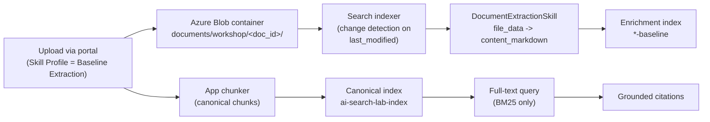

# Lab 03 - Baseline Extraction And Full Text Search

## Goal

Establish the simplest Azure AI Search baseline:

- `DocumentExtractionSkill`
- Blob data source
- Search indexer
- one profile-specific enrichment index
- full text retrieval over the canonical chunk index

## Questions This Lab Answers

- What does `DocumentExtractionSkill` actually do to a file?
- Why is full-text search still important in a RAG workshop?
- What does a lexical baseline tell me before I add chunking and embeddings?
- Why can the baseline return broader or noisier evidence?

This lab uses the **Baseline Extraction** skill profile, which you select per upload from the UI. You no longer edit `WORKSHOP_SKILL_PROFILE` or restart the app between labs.

The workshop's baseline corpus is based on the CEDD report
[*Deep Excavation Design and Construction*](https://www.cedd.gov.hk/filemanager/eng/content_1024/ep1_2023.pdf)
(GEO Publication No. 1/2023), which is the same anchor document used throughout the notebook walkthroughs.

## Ingestion Method At A Glance

The baseline profile runs the shortest possible Blob + skillset pipeline. A single built-in skill (`DocumentExtractionSkill`) cracks the file into text; nothing chunks, embeds, or enriches it yet. That intentionally minimal graph is the control group every later lab is measured against.



Two indexes are written on every ingest, and it is worth being explicit about the split because it recurs in every lab:

- The **canonical index** (`ai-search-lab-index`) holds the app-owned chunks that the chat retrieval modes actually query.
- The **enrichment index** (`*-baseline`) is the Search-managed skillset output, which later labs progressively enrich. The baseline keeps it nearly empty so you can watch it fill up as skills are added.

## Step 1 - Start the app

Always launch through the helper script so `.env` is loaded into the process environment. A raw `uvicorn` invocation does **not** read `.env`, which leaves the Azure feature flags unset and silently disables Search, Foundry, and enrichment:

```powershell
.\scripts\run-local-app.ps1 -Port 8016
```

## Step 2 - Confirm the profile is available

Open [http://127.0.0.1:8016/api/workshop/profiles](http://127.0.0.1:8016/api/workshop/profiles) and confirm:

- `baseline_extract` appears in the `profiles` list
- its target enrichment index name ends with `-baseline`

## Step 3 - Upload the workshop document

Use one representative document and keep it for the rest of the workshop.

On the upload screen, set the **Skill Profile** picker to **Baseline Extraction** before submitting.

Recommended document traits:

- 50+ pages if possible
- headings and section changes
- at least one diagram or structured figure

## Step 4 - Wait for the corpus to reach `ready`

Use the portal:

- `Ingestion`
- `Knowledge Base`

Confirm:

- document status is `ready`
- Blob + skillset enrichment completed

## Step 5 - Set the chat retrieval mode to `Full text`

In the chat UI:

1. use `Custom Selection`
2. pick only the newly uploaded corpus
3. choose `Full text`

## Step 6 - Ask the baseline prompts

- `What major sections and themes are present in this document?`
- `Which exact phrases from the document best describe the main architecture or workflow?`
- `What part of the document best matches the phrase "indexing and retrieval"?`

## Step 7 - Explain what the audience should notice

Call out:

- exact-term sensitivity
- lexical matching strength
- lexical miss behavior when the wording changes
- broader or noisier evidence when chunking and semantic signals are still minimal

## Success Criteria

- the document reaches `ready`
- Blob + skillset enrichment completes
- the enrichment index recorded in the job ends with `-baseline`
- full text search returns grounded citations over the selected corpus

## Code Walkthrough

The baseline profile deliberately adds only one built-in skill:

```python
# backend/services/workshop_profiles.py
WorkshopSkillProfile(
    id="baseline_extract",
    added_skills=("DocumentExtractionSkill",),
    cumulative_skills=("DocumentExtractionSkill",),
    recommended_retrieval_modes=("full_text",),
)
```

- This is the control group for the rest of the workshop.
- The goal is to show what Azure AI Search can do with only extracted text and lexical matching.

This is the actual skill definition the Search skillset uses:

```python
# backend/services/search_skillset_enrichment.py
skills = [self._build_extractor_skill(extractor_kind=extractor_kind)]

return {
    "@odata.type": "#Microsoft.Skills.Util.DocumentExtractionSkill",
    "name": "#documentExtraction",
    "configuration": {"imageAction": "generateNormalizedImages"},
    "inputs": [{"name": "file_data", "source": "/document/file_data"}],
    "outputs": [{"name": "content", "targetName": "content_markdown"}],
}
```

- `DocumentExtractionSkill` turns the Blob file into `content_markdown`.
- `imageAction=generateNormalizedImages` is important because it prepares image derivatives even before OCR and image analysis are turned on in later labs.

> **Which extractor actually runs?** `_build_extractor_skill` honours a global override, `AZURE_SEARCH_SKILLSET_PREFERRED_EXTRACTOR`. The repo now ships with this set to `document_layout`, so the resource-attached `DocumentIntelligenceLayoutSkill` replaces `DocumentExtractionSkill` as the cracking step across all profiles (it emits the same `content_markdown` plus figure-aware crops used in Lab 06). The lexical baseline behaves the same either way; set the variable back to `document_extraction` if you want the literal minimal skill shown above. The selection logic lives in `_active_extractor_kind`.

Baseline retrieval is intentionally simple:

```python
# backend/services/indexing.py
if retrieval_mode == "full_text":
    # Pure BM25. No queryType=semantic, no semantic reranking, no captions.
    body["search"] = question
    return body
```

- This is plain lexical search over the canonical chunk index.
- It is deliberately kept to pure BM25 so it stays an honest lexical control group. The semantic ranker (L2 reranking) is not added until `hybrid` in Lab 04, which keeps the lexical-versus-semantic comparison clean.
- It is the right baseline for demonstrating term sensitivity and lexical misses.

### How the app turns your question into a Search request

The chat box does not call Azure directly. The question flows through `_build_direct_search_body`, which assembles the JSON request body for the chosen mode, and `_run_direct_search`, which POSTs it to the index. For the baseline the body is about as small as a Search request gets - a query string, a row cap, a field projection, and an optional corpus filter:

```python
# backend/services/indexing.py - _build_direct_search_body (full_text branch)
body: dict[str, Any] = {
    "top": DIRECT_SEARCH_TOP,
    "count": True,
    "select": self._direct_search_select_fields(),   # chunk_id, clean_text, page_numbers, ...
}
if filter_expression:
    body["filter"] = filter_expression               # restrict to the selected corpus

if retrieval_mode == "full_text":
    body["search"] = question                        # BM25 over searchable fields
    if applied_scoring_profile:
        body["scoringProfile"] = applied_scoring_profile
    return body
```

```python
# backend/services/indexing.py - _run_direct_search (the actual call)
url = f"{self.endpoint}/indexes/{source.index_name}/docs/search?api-version=2025-09-01"
response = requests.post(url, headers=self.headers, data=json.dumps(body), timeout=60)
self._raise_for_status(response)
payload = response.json()
```

- `select` keeps the response lean by returning only the fields the chat UI renders as citations.
- `filter` is how `Custom Selection` scopes the query to just the corpus you picked.
- Notice there is no `vectorQueries`, no `queryType`, and no `scoringProfile` by default - that minimalism is exactly what makes this the lexical control group.

## Index Lifecycle: Freshness, Change Detection, And Deletion

The baseline lab is the first place the Blob data source and Search indexer appear, so it is the right place to make the index lifecycle explicit. A RAG index is not a one-shot load - it has to stay in sync with the Blob container as documents change.

This workshop relies on the indexer's **built-in change detection**. The blob indexer tracks each blob's `metadata_storage_last_modified` value as a high-water mark and only reprocesses blobs whose timestamp moved. That same timestamp is mapped into a queryable `last_updated` field:

```python
# backend/services/search_skillset_enrichment.py - _build_indexer_body (abridged)
"fieldMappings": [
    {"sourceFieldName": "metadata_storage_path", "targetFieldName": "doc_key",
     "mappingFunction": {"name": "base64Encode"}},
    {"sourceFieldName": "metadata_storage_last_modified", "targetFieldName": "last_updated"},
],
```

- Re-uploading a changed document re-indexes only that blob, not the whole container.
- `last_updated` is `filterable` and `sortable` in the index schema, so it powers freshness filters today and the `freshness-boosted` scoring-function profile you switch on in Lab 04.

The indexer can also **skip unchanged skill work** when the enrichment cache is enabled:

```python
# backend/services/search_skillset_enrichment.py - _build_indexer_body (abridged)
if settings.azure_search_enable_enrichment_cache and settings.azure_search_enrichment_cache_connection_string:
    body["cache"] = {
        "storageConnectionString": settings.azure_search_enrichment_cache_connection_string,
        "enableReprocessing": True,
    }
```

- Incremental enrichment caching means an unchanged document does not pay for OCR, image analysis, or prompt skills again on a rerun.

**Deletion is the gap to call out.** The data source this app builds defines no `dataDeletionDetectionPolicy`, so deleting a blob does **not** remove its documents from the index automatically - the indexer only adds and updates. The app handles removals explicitly on the canonical index instead:

```python
# backend/services/indexing.py
def delete_chunks(self, chunks: list[ChunkRecord], *, index_name: str | None = None) -> None:
    ...
    actions = [{"@search.action": "delete", "chunk_id": chunk.chunk_id} for chunk in chunks]
```

For a production Blob-driven index you would close that gap with a [soft-delete deletion detection policy](https://learn.microsoft.com/en-us/azure/search/search-howto-index-changed-deleted-blobs) on the data source, an indexer [schedule](https://learn.microsoft.com/en-us/azure/search/search-howto-schedule-indexers) for periodic pickup, and a [reset and rerun](https://learn.microsoft.com/en-us/azure/search/search-howto-run-reset-indexers) when you change the skillset or schema and need a full reprocess.

## Configuration Knobs

| Variable | What it controls | Good value for this lab |
| --- | --- | --- |
| `WORKSHOP_SKILL_PROFILE` | Default selection of the **Skill Profile** picker. | `baseline_extract` |
| `AZURE_SEARCH_SKILLSET_PREFERRED_EXTRACTOR` | Chooses the extractor implementation. | `document_extraction` |
| `AZURE_SEARCH_REQUIRE_BLOB_SKILLSET_SUCCESS` | Stops the workshop on broken skillset runs. | `true` |
| `DEFAULT_INGESTION_MODE` | Keeps uploads on the Blob + skillset pipeline. | `hybrid_blob_skillset` |

## Best-Practice Takeaways

- establish a lexical baseline before claiming semantic improvement
- treat extracted text as a starting point, not the final retrieval unit
- keep parser-side figure work out of the baseline so you can attribute later improvements to the visual lab
- compare the same prompts across labs so improvements remain measurable
- plan for index freshness early: change detection keeps re-uploads cheap, but blob deletions need an explicit deletion policy or app-side delete

## Files To Inspect

- [`backend/services/workshop_profiles.py`](../../backend/services/workshop_profiles.py) for the baseline profile declaration.
- [`backend/services/search_skillset_enrichment.py`](../../backend/services/search_skillset_enrichment.py) for the Search skillset body.
- [`backend/services/indexing.py`](../../backend/services/indexing.py) for the direct full-text request.
- [`backend/app.py`](../../backend/app.py) for how the portal selects `full_text`.

## Learn References

- [Skillset concepts](https://learn.microsoft.com/en-us/azure/search/cognitive-search-working-with-skillsets)
- [Document Extraction skill](https://learn.microsoft.com/en-us/azure/search/cognitive-search-skill-document-extraction)
- [Create a full-text query](https://learn.microsoft.com/en-us/azure/search/search-query-create)
- [BM25 relevance scoring](https://learn.microsoft.com/en-us/azure/search/index-similarity-and-scoring)
- [Detect changed and deleted blobs](https://learn.microsoft.com/en-us/azure/search/search-howto-index-changed-deleted-blobs)
- [Schedule an indexer](https://learn.microsoft.com/en-us/azure/search/search-howto-schedule-indexers)
- [Reset and rerun indexers](https://learn.microsoft.com/en-us/azure/search/search-howto-run-reset-indexers)
