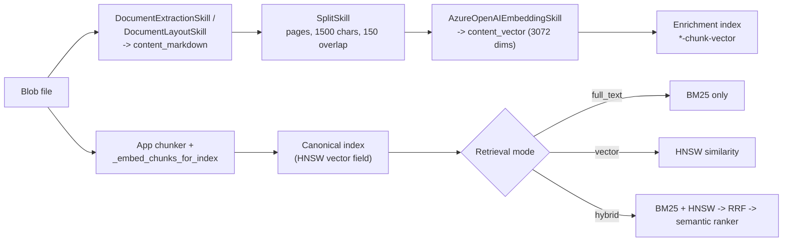
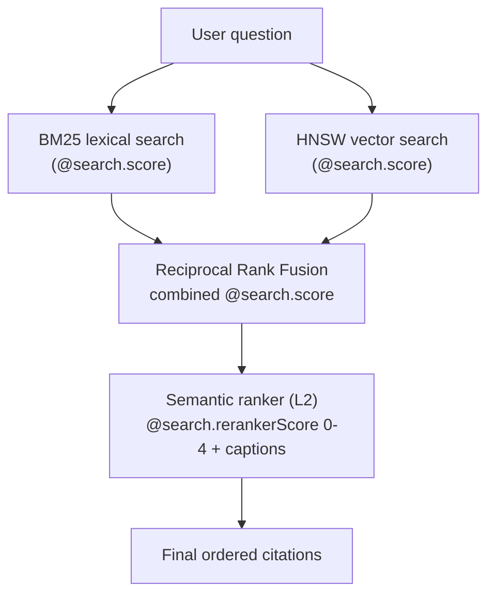

# Lab 04 - Chunking, Embeddings, And Vector Search

## Goal

Re-index the same document with built-in chunk-aware enrichment and embeddings:

- `SplitSkill`
- `AzureOpenAIEmbeddingSkill`

Then compare:

- full text search
- vector search
- hybrid search

## Questions This Lab Answers

- Why does chunking matter so much for RAG quality?
- What is the difference between a good chunk and a bad chunk?
- When should `vector` beat `full_text`, and when should `full_text` still win?
- Why is `hybrid` often the safest direct-search default?

This lab uses the **Chunking And Vectorization** skill profile, selected per upload from the UI.

## Ingestion Method At A Glance

This profile keeps the same extractor but adds two built-in skills - `SplitSkill` to break `content_markdown` into chunk-sized pages, and `AzureOpenAIEmbeddingSkill` to vectorize them. The result is an enrichment index that now carries embeddings, plus a canonical index whose vectors are computed app-side so query and document vectors come from the same model.



The single most important idea in this lab is what happens inside the `hybrid` branch, where two independently ranked lists are fused and then reranked:



## Step 1 - Start the app

Launch through the helper script if it is not already running:

```powershell
.\scripts\run-local-app.ps1 -Port 8016
```

## Step 2 - Confirm the profile is available

Open [http://127.0.0.1:8016/api/workshop/profiles](http://127.0.0.1:8016/api/workshop/profiles) and confirm:

- `chunk_vector` appears in the `profiles` list
- its target enrichment index name ends with `-chunk-vector`

## Step 3 - Upload the same document again

Do not change the source file. The point is to isolate the effect of chunking and embeddings. On the upload screen, set the **Skill Profile** picker to **Chunking And Vectorization** before submitting.

## Step 4 - Compare the same question across three retrieval modes

Use `Custom Selection` and the newly uploaded corpus.

Ask the same question three times:

1. `Full text`
2. `Vector`
3. `Hybrid`

Recommended prompts:

- `Which specific chunk best explains the architecture workflow in this document?`
- `Find the part that discusses indexing, grounding, and answer generation even if those exact words are not written together.`
- `Which passage best explains how the system moves from document ingestion to retrieval quality?`

## Step 5 - Explain what changed

Compared with Lab 03, this profile adds:

- chunk-oriented enrichment output
- embeddings for semantic matching
- hybrid search over the same chunk corpus

Call out:

- why vector search can recover paraphrases
- why hybrid often becomes the most stable direct-search mode
- how chunking reduces whole-document noise

## Step 6 - Capture observations

Have the audience record:

- which mode found the most relevant chunk
- which mode produced the cleanest evidence list
- where lexical search still won

## Success Criteria

- the document reaches `ready`
- Blob + skillset enrichment completes
- the enrichment index recorded in the job ends with `-chunk-vector`
- vector and hybrid search both return grounded results

## Code Walkthrough

This profile adds chunk-aware enrichment and embeddings on top of the baseline extractor:

```python
# backend/services/workshop_profiles.py
WorkshopSkillProfile(
    id="chunk_vector",
    added_skills=("SplitSkill", "AzureOpenAIEmbeddingSkill"),
    cumulative_skills=(
        "DocumentExtractionSkill",
        "SplitSkill",
        "AzureOpenAIEmbeddingSkill",
    ),
    recommended_retrieval_modes=("full_text", "vector", "hybrid"),
)
```

- The document stays the same.
- The index gets richer because Search now stores chunk-oriented text slices and embeddings.

This is how the Search skillset adds chunking and vectorization:

```python
# backend/services/search_skillset_enrichment.py
def _build_split_skill(self) -> dict[str, Any]:
    return {
        "@odata.type": "#Microsoft.Skills.Text.SplitSkill",
        "textSplitMode": "pages",
        "maximumPageLength": 1500,
        "pageOverlapLength": 150,
        "inputs": [{"name": "text", "source": "/document/content_markdown"}],
    }

def _build_embedding_skill(self, *, text_source: str = "/document/summary_text") -> dict[str, Any]:
    return {
        "@odata.type": "#Microsoft.Skills.Text.AzureOpenAIEmbeddingSkill",
        "deploymentId": settings.azure_openai_embedding_deployment,
        "dimensions": settings.azure_search_vector_dimensions,
    }
```

- `SplitSkill` makes the enrichment lane more retrieval-friendly.
- `AzureOpenAIEmbeddingSkill` enables semantic similarity search over those enriched fields.

> Two embedding paths, on purpose. The Search-side `AzureOpenAIEmbeddingSkill` (integrated vectorization) only populates the **enrichment index**. The `vector` and `hybrid` chat modes query the **canonical chunk index**, whose vectors are produced app-side in `_embed_chunks_for_index`, and the query itself is embedded app-side too. Using the same embedding model for both index and query is what keeps vector similarity meaningful. The canonical index defines an HNSW profile but no `vectorizer`, so it expects pre-computed query vectors rather than `text`-kind vector queries.

This is the direct-search switch in the app:

```python
# backend/services/indexing.py
if retrieval_mode == "full_text":
    body["search"] = question          # pure BM25, no reranking
    return body

if retrieval_mode == "vector":
    body["search"] = "*"
    body["vectorQueries"] = [{"kind": "vector", "vector": query_vector, ...}]
    return body

# hybrid: BM25 + vector fused by RRF, then reranked by the semantic ranker
body["search"] = question
body["queryType"] = "semantic"
body["semanticConfiguration"] = "default-semantic-config"
body["captions"] = "extractive|highlight-false"
body["vectorQueries"] = [{"kind": "vector", "vector": query_vector, ...}]
```

- `full_text` is lexical only (BM25).
- `vector` is embedding similarity only (HNSW).
- `hybrid` runs both, fuses the two ranked lists with [Reciprocal Rank Fusion (RRF)](https://learn.microsoft.com/en-us/azure/search/hybrid-search-ranking), and then applies the [semantic ranker](https://learn.microsoft.com/en-us/azure/search/semantic-search-overview) to rerank the fused top results and return extractive captions.

### How hybrid ranking actually works

This is the most important concept in the lab, so make it explicit:

1. **BM25** scores the lexical query and produces `@search.score`.
2. **HNSW vector search** scores the embedding query and produces its own `@search.score`.
3. **RRF** fuses both ranked lists into one combined `@search.score`. Documents that rank highly in either list rise to the top.
4. **Semantic ranker (L2)** takes the fused top results and reranks them with a Bing-derived model, producing `@search.rerankerScore` on a 0 to 4 scale plus extractive captions.

The app sorts direct results by `@search.rerankerScore` first and `@search.score` second, which is why `hybrid` results can reorder relative to a pure BM25 or pure vector run:

```python
# backend/services/indexing.py
def _direct_result_rank(item):
    return (
        float(item.get("@search.rerankerScore") or 0),
        float(item.get("@search.score") or 0),
    )
```

Because `full_text` is pure BM25 it has no `@search.rerankerScore`, so it falls back to the BM25 score. The semantic ranker is a separately billed premium feature with [regional limits](https://learn.microsoft.com/en-us/azure/search/search-region-support); if `hybrid` queries fail, confirm semantic ranker is enabled on the search service before debugging anything else.

## Relevance Tuning With Scoring Profiles

The ranking ladder so far ends at the semantic ranker, but that is not the only relevance lever Azure AI Search exposes. This lab also ships [scoring profiles](https://learn.microsoft.com/en-us/azure/search/index-add-scoring-profiles) so you can change relevance live and watch results reorder.

A scoring profile is attached to the index definition and influences the **BM25 layer** - the lexical score that feeds `full_text` directly and forms half of the fused `hybrid` result. It does two things the semantic ranker cannot:

- **Field weighting.** BM25 treats every searchable field equally by default. A scoring profile lets you say a hit in `summary_text` or `keyword_hints` is worth more than a hit in raw `clean_text`, so a term that lands in the curated enrichment fields outranks the same term buried in body text.
- **Scoring functions.** You can boost results by a `freshness` function over `last_updated`, by tag membership, or by a magnitude field, before fusion and reranking ever run.

The canonical index now defines two named scoring profiles alongside the semantic configuration and HNSW vector profile:

```python
# backend/services/indexing.py - _build_scoring_profiles (abridged)
return [
    {
        "name": "enrichment-weighted",
        "text": {"weights": {
            "summary_text": 5, "keyword_hints": 4, "source_name": 3,
            "section_path": 2, "clean_text": 1, "image_description_text": 1,
        }},
    },
    {
        "name": "freshness-boosted",
        "functionAggregation": "sum",
        "functions": [{
            "type": "freshness", "fieldName": "last_updated", "boost": 4,
            "interpolation": "linear", "freshness": {"boostingDuration": "P365D"},
        }],
    },
]
```

The chat request body attaches the chosen profile **only** for `full_text` and `hybrid`, because scoring profiles act on the BM25 text score. Pure `vector` is scored by HNSW similarity and `agentic` runs its own retrieve path, so both ignore the profile:

```python
# backend/services/indexing.py - _resolve_scoring_profile (abridged)
if retrieval_mode not in {"full_text", "hybrid"}:
    return None                      # vector + agentic ignore scoring profiles
if not normalized or normalized == "default":
    return None                      # "default" = send no scoringProfile
return normalized                    # attached as body["scoringProfile"]
```

### Step 7 - Compare scoring profiles on the same question

In the chat UI, the **Scoring Profile** picker sits directly under the retrieval-mode picker:

1. Set retrieval mode to `Full text` (the effect is easiest to see without semantic reranking on top).
2. Ask one of the prompts above with `Default` selected and note the top results.
3. Re-ask the same prompt with `Enrichment-weighted`. Chunks whose hit lands in `summary_text` or `keyword_hints` should climb.
4. Re-ask once more with `Freshness-boosted`. More recently indexed corpora should rise.
5. Switch retrieval mode to `Hybrid` and repeat to see how a scoring profile changes the BM25 half *before* RRF and the semantic ranker reorder the fused set.
6. Open `Toggle Debug` and confirm `diagnostics.scoring_profile` and each activity step's `scoringProfile` match what you selected.

The picker greys out for `Vector` and `Agentic retrieval` because those modes do not consume a scoring profile.

Key points to make explicit for the audience:

- A scoring profile and the semantic ranker are **complementary**, not alternatives. The scoring profile shapes the BM25 inputs that RRF fuses; the semantic ranker then reorders the fused top set. Field weights change *what* rises into the rerank window; the ranker changes *how* that window is ordered.
- Scoring profiles are free and run inside the index; the semantic ranker is separately billed. Field weighting is often the cheapest first move when one field (here, the curated `summary_text`) is clearly more trustworthy than the rest.
- `Default` sends no scoring profile, so it reproduces the Labs 03-07 baseline exactly. Keeping `Default` as the control means any reorder you see is attributable to the profile you picked, which keeps the comparison honest.

## Configuration Knobs

| Variable | What it controls | Good workshop variation |
| --- | --- | --- |
| `WORKSHOP_SKILL_PROFILE` | Activates this profile. | `chunk_vector` |
| `AZURE_OPENAI_EMBEDDING_DEPLOYMENT` | Embedding deployment used by the Search skill. | Point to your embedding deployment alias, such as `text-embedding-3-large-vector`. |
| `AZURE_OPENAI_EMBEDDING_MODEL_NAME` | Embedding model family used by the Search vectorizer. | Keep this on `text-embedding-3-large` unless you intentionally switch model families. |
| `AZURE_SEARCH_ENABLE_INTEGRATED_VECTORIZATION` | Whether the Search skillset writes vector fields into the **enrichment index** during indexing via `AzureOpenAIEmbeddingSkill`. | Keep `true` for this lab. |
| `CHUNK_SIZE_TOKENS` | App-owned canonical chunk size. | Lower it to show more granular retrieval. |
| `CHUNK_OVERLAP_TOKENS` | App-owned chunk overlap. | Increase it to show better continuity at boundaries. |
| `USE_SEMANTIC_CHUNKING` | App chunker behavior, separate from Search `SplitSkill`. | Toggle only if you want to contrast app chunking with Search chunking. |

## Best-Practice Takeaways

- chunking is a first-class retrieval design choice, not a preprocessing afterthought
- embeddings are only as useful as the chunk boundaries they represent
- hybrid search is usually the best direct-search comparison mode because it blends lexical and semantic signals
- compare Search-managed chunking and app-managed chunking deliberately instead of assuming they solve the same problem
- reach for a scoring profile (field weights, freshness) before more expensive layers when one field is clearly more trustworthy than the rest

## Files To Inspect

- [`backend/services/workshop_profiles.py`](../../backend/services/workshop_profiles.py) for the lab declaration.
- [`backend/services/search_skillset_enrichment.py`](../../backend/services/search_skillset_enrichment.py) for `SplitSkill` and `AzureOpenAIEmbeddingSkill`.
- [`backend/services/chunking.py`](../../backend/services/chunking.py) for the app-owned canonical chunker.
- [`backend/services/indexing.py`](../../backend/services/indexing.py) for the direct search request bodies.

## Learn References

- [Chunk documents for vector search and agentic retrieval](https://learn.microsoft.com/en-us/azure/search/vector-search-how-to-chunk-documents)
- [Text Split skill](https://learn.microsoft.com/en-us/azure/search/cognitive-search-skill-textsplit)
- [Azure OpenAI Embedding skill](https://learn.microsoft.com/en-us/azure/search/cognitive-search-skill-azure-openai-embedding)
- [Vector search overview](https://learn.microsoft.com/en-us/azure/search/vector-search-overview)
- [Hybrid search overview](https://learn.microsoft.com/en-us/azure/search/hybrid-search-overview)
- [Relevance scoring in hybrid search using RRF](https://learn.microsoft.com/en-us/azure/search/hybrid-search-ranking)
- [Semantic ranking in Azure AI Search](https://learn.microsoft.com/en-us/azure/search/semantic-search-overview)
- [Add scoring profiles to boost relevance](https://learn.microsoft.com/en-us/azure/search/index-add-scoring-profiles)
