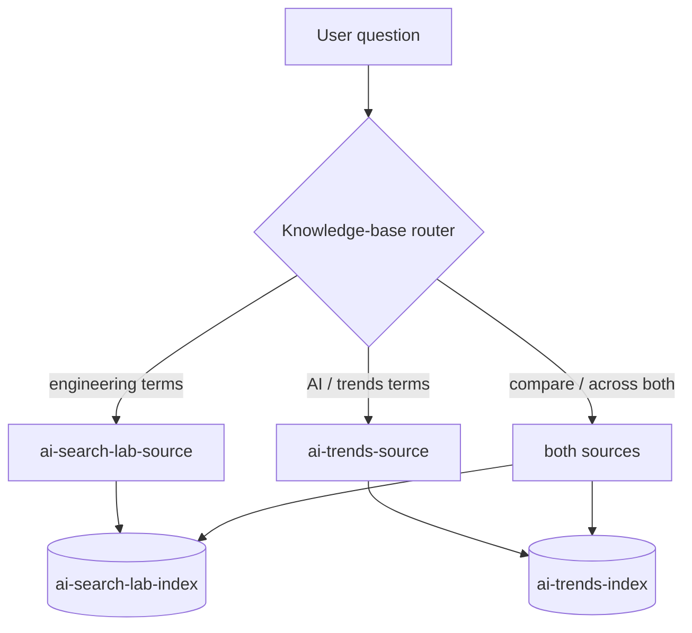

# Lab 09 - Multi-Source Knowledge Routing

## Goal

Add a second, separate knowledge source on a different topic and watch the knowledge base decide, per question, **which index (or indexes) to search**.

## Questions This Lab Answers

- How do I make one assistant search across **multiple independent corpora**?
- What is the difference between a **knowledge source**, its **index**, and the **knowledge base** that ties them together?
- How does Azure AI Search decide **which index a document lands in** at ingest time?
- How does it decide **which index answers a question** at query time?
- What are the routing modes (`keyword_routed`, `cross_source_intent`, `broad_auto`, `primary_default`) and how do I tune them?

Until now every lab has searched a single corpus - the deep-excavation engineering document. This lab introduces a **second corpus on a completely unrelated topic** (the future of generative AI) so you can see source selection in action. The deployed assistant already supports this; you only register the extra source and ingest a document into it.

## Concept - Sources, Indexes, and the Knowledge Base



- A **knowledge source** is a named pointer to one **search index** plus routing metadata (`route_keywords`, `assignment_keywords`, a description, and which fields to search and return).
- A **knowledge base** references one or more knowledge sources. When you ask a question in `auto` corpus mode, the knowledge base **routes** the query to the source(s) most likely to answer it.
- The **primary** source (`ai-search-lab-source` -> `ai-search-lab-index`) always exists. **Extra** sources are added through configuration.

## Step 1 - Register the second knowledge source

Add an extra source by setting `AZURE_SEARCH_EXTRA_SOURCES_JSON` in `.env` to a JSON list. Each entry maps a knowledge-source name to an index and supplies the routing hints:

```dotenv
AZURE_SEARCH_EXTRA_SOURCES_JSON=[{"knowledge_source_name":"ai-trends-source","index_name":"ai-trends-index","description":"Artificial intelligence technology trends, forecasts, and emerging innovation outlook.","route_keywords":["artificial intelligence","machine learning","trends","future","innovation","forecast","generative","models","adoption"],"assignment_keywords":["future","trends","innovation","forecast","artificial intelligence","machine learning","generative"]}]
```

Field meanings:

| Field | Phase | Purpose |
| --- | --- | --- |
| `knowledge_source_name` | both | Logical name registered on the knowledge base. |
| `index_name` | both | The dedicated search index this source reads/writes. **Auto-created** on first ingest - you do not create it by hand. |
| `description` | query | Helps the router (and any semantic planning) understand what the source covers. |
| `route_keywords` | query | If a question matches these, the query is routed to this source. |
| `assignment_keywords` | ingest | If an uploaded document's name or headings match these, the document is stored in this source's index. |

Restart the app after editing `.env` so the new source is parsed into `settings.azure_search_extra_sources`:

```powershell
.\scripts\run-local-app.ps1 -Port 8016
```

## Step 2 - Ingest a document on the new topic

Upload a document whose topic and filename point at the new source. This lab uses `data/ai-future-trends.pdf` (a generative-AI outlook report). At ingest time, routing reads the document name and section headings and scores them against every source's `assignment_keywords`:

- `name_matches x 3 + context_matches x 1`
- a source is eligible when `name_matches >= 1` **or** `context_matches >= 2`

The filename tokens `future` and `trends` match `ai-trends-source`, so the document is assigned there with `assignment_mode: keyword_assigned`. The engineering document, with no AI-trends terms, stays on the primary index.

> Tip: the **filename** is the strongest assignment signal (weighted x3). Naming the file `ai-future-trends.pdf` deterministically routes it to the AI-trends source.

## Step 3 - Preview query-time routing

Before searching, you can preview exactly which index a question will hit. The knowledge-base router classifies each question into a **routing mode**:

| Mode | Trigger | Result |
| --- | --- | --- |
| `custom_doc_scope` | the request pins specific `doc_ids` | those documents' sources, forced via `alwaysQuerySource` |
| `cross_source_intent` | compare / across / between / versus language | **all** publishable sources |
| `keyword_routed` | the question matches a source's `route_keywords` (or a published document's terms) | only the matching source(s) |
| `broad_auto` | nothing matched, but source count <= `AZURE_SEARCH_AUTO_BROADCAST_LIMIT` | all sources (fan out) |
| `primary_default` | nothing matched and there are too many sources to fan out | the primary index only |

The three demo questions in this lab map cleanly to three modes:

- "What does the report forecast about generative AI adoption trends...?" -> `keyword_routed` -> `ai-trends-index` only.
- "What groundwater control measures are recommended to support a deep excavation?" -> `keyword_routed` -> `ai-search-lab-index` only (the term *excavation* matches the published engineering corpus).
- "Compare how risk and forecasting are treated across the two indexes." -> `cross_source_intent` -> **both** indexes.

## Step 4 - Run it and confirm which index served each hit

Run a hybrid search for each question with **no** pinned documents, so the router (not a manual selection) decides scope. Every hit reports the index it came from:

- The AI question returns hits **only** from `ai-trends-index` (source document `ai-future-trends.pdf`).
- The excavation question returns hits **only** from `ai-search-lab-index`.
- The compare question draws candidates from both indexes; the synthesized answer then cites whichever chunks are most relevant.

The companion notebook [`notebooks/lab-09-multi-source-routing.ipynb`](../../notebooks/lab-09-multi-source-routing.ipynb) runs all of this end to end with tables and grounded answers.

## Success Criteria

- `settings.azure_search_extra_sources` lists `ai-trends-source` -> `ai-trends-index` after restart.
- Ingesting the AI-trends document reports `assignment_mode: keyword_assigned` and `index_name: ai-trends-index`, and `ai-trends-index` is auto-created (`index_names` includes both indexes).
- The AI question routes `keyword_routed` to `ai-trends-index` only; the excavation question routes to `ai-search-lab-index` only; the compare question routes `cross_source_intent` to both.
- A grounded `auto`-corpus answer to the AI question cites the AI-trends document, with no excavation chunks leaking in.

## Code Walkthrough

Extra sources are parsed from configuration into typed source configs:

```python
# backend/core/config.py
# AZURE_SEARCH_EXTRA_SOURCES_JSON -> list[SearchKnowledgeSourceConfig]
SearchKnowledgeSourceConfig(
    knowledge_source_name="ai-trends-source",
    index_name="ai-trends-index",
    description="Artificial intelligence technology trends, forecasts, ...",
    route_keywords=("artificial intelligence", "trends", "future", "forecast", ...),
    assignment_keywords=("future", "trends", "forecast", "generative", ...),
)
```

Every publishable source (primary + extras) gets its index created or updated on ingest:

```python
# backend/services/indexing.py  (_ensure_indexes)
for source in self._publishable_knowledge_sources():
    self._ensure_index(source.index_name, ...)   # create-or-update PUT
```

Ingest-time assignment scores the document name and headings against each source's `assignment_keywords`:

```python
# backend/services/indexing.py  (_select_target_source_for_document)
score = name_matches * 3 + context_matches * 1
eligible = name_matches >= 1 or context_matches >= 2
# -> {"assignment_mode": "keyword_assigned", "assignment_matches": best_matches}
```

Query-time routing classifies the question and selects the search indexes:

```python
# backend/services/indexing.py  (_route_knowledge_sources)
# modes: custom_doc_scope | cross_source_intent | keyword_routed | broad_auto | primary_default
# returns selected_search_indexes + per-source matched_terms diagnostics
```

## Configuration Knobs

| Setting | Default | Effect |
| --- | --- | --- |
| `AZURE_SEARCH_EXTRA_SOURCES_JSON` | `[]` | Registers additional knowledge sources (name, index, description, route/assignment keywords). |
| `route_keywords` (per source) | - | Query-time hints; a match routes the question to that source (`keyword_routed`). |
| `assignment_keywords` (per source) | - | Ingest-time hints; a document name/heading match assigns the document to that source's index. |
| `AZURE_SEARCH_AUTO_BROADCAST_LIMIT` | `4` | Max sources to fan out to when nothing matched (`broad_auto`); above it, falls back to `primary_default`. |
| `doc_ids` on a request | - | Forces `custom_doc_scope` and pins the query to those documents' sources via `alwaysQuerySource`. |

## Best-Practice Takeaways

- Give each corpus its **own index** and register it as a knowledge source - this keeps grounded answers on-topic and lets you scale to many subjects.
- Use **distinct, specific `route_keywords`** per source. Overlapping keywords cause questions to fan out unnecessarily; sparse keywords cause `primary_default` misses.
- Lead with the **filename** for deterministic ingest assignment - it is weighted three times heavier than heading matches.
- Reserve **compare/across** phrasing for genuinely cross-corpus questions; it intentionally triggers a wider, more expensive fan-out.
- Tune `AZURE_SEARCH_AUTO_BROADCAST_LIMIT` to balance recall (fan out to everything) against cost and precision (fall back to the primary index) as the number of sources grows.
